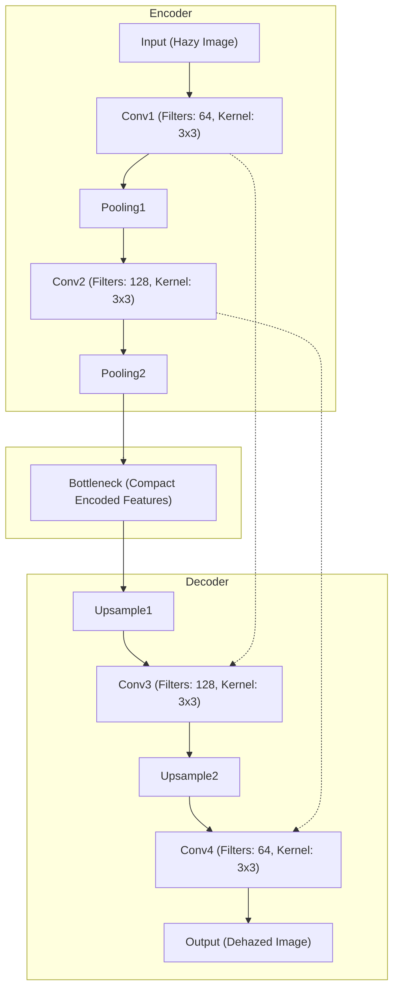

# Encoder-Decoder Architecture for Image Dehazing

## Introduction

The Encoder-Decoder architecture is a prevalent design in deep learning, especially for tasks like image-to-image translation, which includes use-cases such as image dehazing, segmentation, and super-resolution. This architecture can capture the spatial hierarchies of an image and can reconstruct an output by upsampling the encoded features.

## Architecture Overview

### Encoder:

- **Function**: The encoder's role is to compress the input data, in this case, a hazy image, into a compact latent representation.
- **Structure**: It typically consists of convolutional layers followed by pooling layers. As we progress deeper into the encoder, the spatial dimensions (width and height) of the feature maps tend to decrease while the depth (number of channels) increases.

### Bottleneck:

- This is the deepest layer and represents the compressed knowledge of the input data. It can be seen as a fixed-size vector that contains essential information from which the decoder will reconstruct the output.

### Decoder:

- **Function**: The decoder's purpose is to expand the latent representation from the encoder into the final desired output, in our case, a dehazed image.
- **Structure**: The decoder typically consists of upsampling layers followed by convolutional layers. The spatial dimensions increase, and the depth decreases as we move deeper into the decoder, eventually resulting in an output of the same spatial dimensions as the input.

## Block Diagram

*This block diagram was generated by a [mermaid code snippet](./../../utils/block-diagram.mmd)*

## Advantages:

1. **Hierarchical Feature Learning**: The architecture can learn features at varying levels of granularity, capturing both global structures and fine details.
2. **Flexibility**: Encoder-Decoder models can be adapted to various tasks, from image segmentation to machine translation.
3. **Compact Representation**: The bottleneck layer provides a compact representation of the input, filtering out noise and retaining significant features.

## Application to Image Dehazing:

For the image dehazing task:

1. **Input**: Hazy image.
2. **Encoder**: Compresses the hazy image into a dense representation, capturing essential features indicative of the haze and underlying structures.
3. **Decoder**: Reconstructs a dehazed image from the encoder's representation, attempting to remove the haze and restore clarity.
4. **Output**: Dehazed image.

Using this architecture for dehazing provides a structured approach to extract features indicative of haze and utilize them to restore the original, haze-free image.

## Enhancements:

1. **Skip Connections**: Introducing skip connections between the encoder and decoder (similar to U-Net) can further help in retaining spatial information and improving the reconstruction quality.
2. **Attention Mechanisms**: Incorporating attention can enable the model to focus on more critical regions of the image during the dehazing process.
3. **Integration with Advanced Blocks**: Leveraging blocks from architectures like ResNet or DenseNet can further improve performance.

